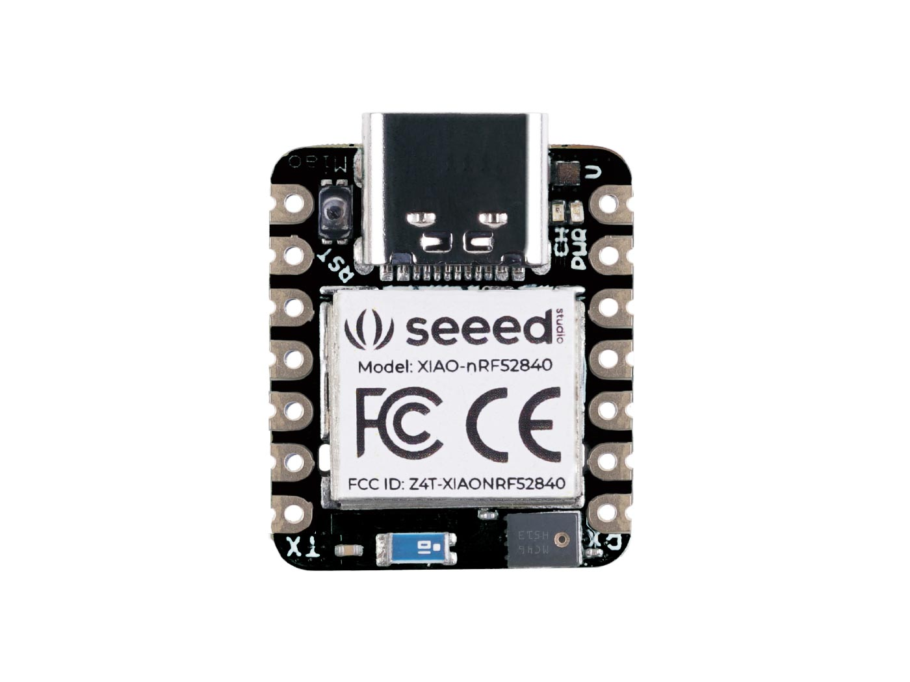
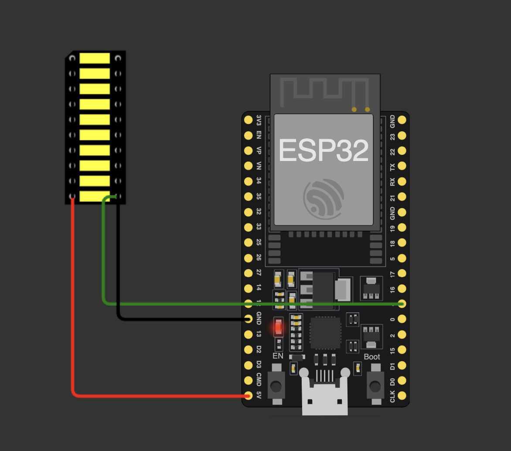
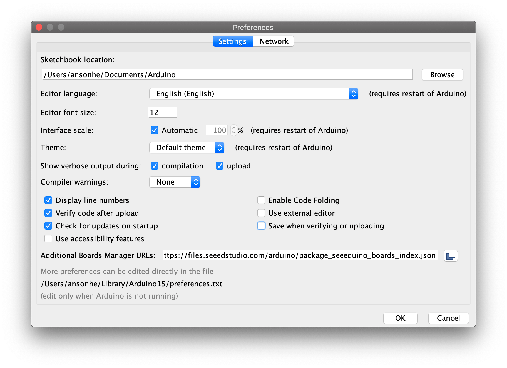
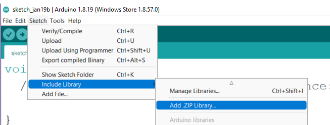
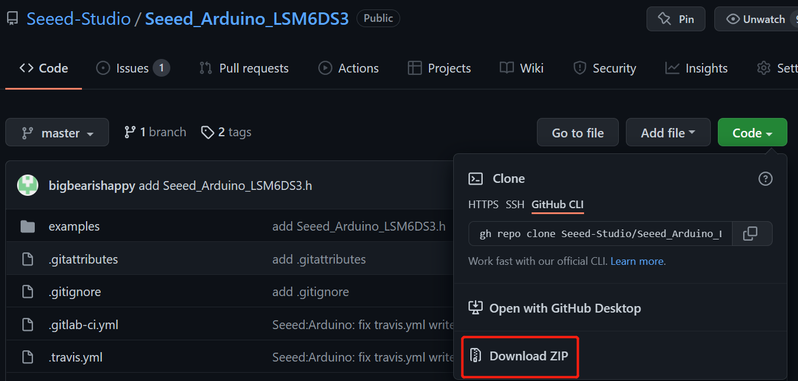

# Internet-of-Things

Repository for 521043S-3004 Internet of Things 2023 Mini Project 2

Made by Group 13:
| Name | Student ID | Email |
| ----------------- | ------------- | ------------------------------- |
| Janne Yrjänäinen | Y58554010 | jyrjanai20@student.oulu.fi |
| Joona Syrjäkoski | Y58172266 | jsyrjako20@student.oulu.fi |

## Project description

This project is a simple IoT project that uses a Seeed Xiao BLE nRF52840 Sense board to analyze the movement and control an ESP32 board through BLE. The ESP32 is attached to a LED strip and the Seeed Xiao is used to control the LED strip through ESP32 and a BLE service. Analyzing of the movements is done on the nRF52840 Sense board using a trained model.

### Project Demo Video:

[](https://youtu.be/y8-wVh2UvLo)

### Seeed Xiao nRF52840 Sense



### ESP32



#### Wiring of the ESP32 and LED strip

| ESP32  | LED Strip |
| ------ | --------- |
| GPIO_4 | DATA      |
| 5V     | 5V        |
| GND    | GND       |

We have included a very basic gesture recognition model. You can create your own motion regonition model with [Edge Impulse](https://docs.edgeimpulse.com/docs/tutorials/end-to-end-tutorials/continuous-motion-recognition/) and use it with this project. The model used in this project is a simple model that recognizes 3 different motions: "UP", "DOWN" and "DOUBLE CLICK". The model is trained with accelerometer data and the data is collected with the Seeed Xiao board. The model is then converted to a Arduino library and used in this project. Detailed [instructions](https://wiki.seeedstudio.com/XIAOEI/) on how to create and use your own model.

## How to use

You need to install the following libraries to Arduino IDE:

- ArduinoBLE
- FastLED
- [Seeed_Arduino_LSM6DS3](https://github.com/Seeed-Studio/Seeed_Arduino_LSM6DS3)

Install custom boards to Arduino IDE:

- esp32 by Espressif
- Seeed Xiao nRF52840 Sense

Navigate to File > Preferences, and fill "Additional Boards Manager URLs" with the urls below:

- https://files.seeedstudio.com/arduino/package_seeeduino_boards_index.json
- https://dl.espressif.com/dl/package_esp32_index.json

<br>



Navigate to Tools > Board > Boards Manager..., type the keyword "seeed nrf52" in the search box, select the latest version of the board you want, and install it. You can install both.


### Seeed Xiao nRF52840 Sense

Download the project and open it in Arduino IDE.
Include the provided Edge Impulse .ZIP library to Arduino IDE from [here](./src/Library/).



Also download and include the [Seeed Arduino LSM6DS3](https://github.com/Seeed-Studio/Seeed_Arduino_LSM6DS3) .ZIP file to Arduino IDE.



After installing the libraries you can compile and upload the code to the boards. Select the correct board from Tools > Board > "Seeed nRF52 mbed-enabled boards" > "Seeed XIAO BLE Sense - nRF52840".

You need to upload the code to both boards. The ESP32 board needs to be connected to a LED strip. The Seeed Xiao board is used to control the LED strip through Bluetooth.

### ESP32

Download the project and open it in Arduino IDE. Before uploading the code you might need to change the following lines in the [code](./src/ESP32_Lightstrip/ESP32_Lightstrip.ino) to match your setup:

```c++
#define LEDSTRIP_PIN 4
#define LEDSTRIP_LEDS 50
#define LED_PIN_BUILTIN 2
#define BRIGHTNESS 64
```

Before flashing the ESP32, select the correct board from Tools > Board > esp32 > (e.g.) NodeMCU-32S.

The internal led of the board will flash blue when the board is not connected to the XIAO nRF52840.

### Gestures

All the gestures can be seen in the demo video. Currently there are 3 different kind of motions: Double Click, Swipe Up and Swipe Down.

| Gesture      | Function           |
| ------------ | ------------------ |
| Swipe Up     | Turn on more leds  |
| Swipe Down   | Turn off some leds |
| Double Click | Toggle lights      |
