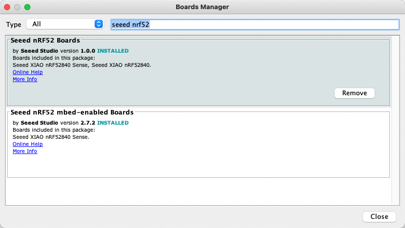

# Internet-of-Things

Repository for 521043S-3004 Internet of Things 2023 Mini Project 2

Made by:
| Name | Student ID | Email |
| ----------------- | ------------- | ------------------------------- |
| Janne Yrjänäinen | Y58554010 | jyrjanai20@student.oulu.fi |
| Joona Syrjäkoski | Y58172266 | jsyrjako20@student.oulu.fi |


## Project description

This project is a simple IoT project that uses a Seeed Xiao BLE nRF52840 Sense board to control an ESP32 board through BLE. The ESP32 is attached to a LED strip and the Seeed Xiao is used to control the LED strip through BLE HID service.

### Seeed Xiao nRF52840 Sense


### ESP32


#### Wiring of the ESP32 and LED strip
| ESP32   | LED Strip |
| ----    | ---- |
| GPIO_4  | DATA |
| 5V      | 5V   |
| GND     | GND  |


You can create your own motion regonition model with Edge Impulse and use it with this project. The model used in this project is a simple model that recognizes 3 different motions: "UP", "DOWN" and "DOUBLE CLICK". The model is trained with accelerometer data and the data is collected with the Seeed Xiao board. The model is then converted to a Arduino library and used in this project.
https://wiki.seeedstudio.com/XIAOEI/


## How to use

 You need to install the following libraries to Arduino IDE:
- ArduinoBLE
- FastLED

Install custom boards to Arduino IDE:
- ESP32
- Seeed Xiao nRF52840 Sense

Navigate to File > Preferences, and fill "Additional Boards Manager URLs" with the urls below:
- https://files.seeedstudio.com/arduino/package_seeeduino_boards_index.json
- https://dl.espressif.com/dl/package_esp32_index.json

<br>


Navigate to Tools > Board > Boards Manager..., type the keyword "seeed nrf52" in the search box, select the latest version of the board you want, and install it. You can install both.



### Seeed Xiao nRF52840 Sense
Download the project and open it in Arduino IDE.

You also need to install the Edge Impulse library to Arduino IDE. You can find the library from [Edge Impulse Arduino Library](./src/Library/)


After installing the libraries you can compile and upload the code to the boards. Before uploading the code you might need to change the following lines in the [code](./src/ESP32_Lightstrip/ESP32_Lightstrip.ino) to match your setup:


```c++
#define LEDSTRIP_PIN 4
#define LEDSTRIP_LEDS 50
#define LED_PIN_BUILTIN 2
#define BRIGHTNESS 64
```


You need to upload the code to both boards. The ESP32 board needs to be connected to a LED strip. The Seeed Xiao board is used to control the LED strip through Bluetooth.


### ESP32

Download the project and open it in Arduino IDE.
